# Solution Architecture Documentation

## Table of Contents

1. [Overview](#overview)
2. [Architecture Principles](#architecture-principles)
3. [System Architecture](#system-architecture)
4. [Component Architecture](#component-architecture)
5. [Data Flow](#data-flow)
6. [Infrastructure Architecture](#infrastructure-architecture)
7. [Security Architecture](#security-architecture)
8. [Deployment Architecture](#deployment-architecture)
9. [Operational Architecture](#operational-architecture)
10. [Technology Stack](#technology-stack)

## Overview

The Aurora PostgreSQL to Snowflake replication system is a serverless, event-driven batch replication solution that securely transfers data from AWS Aurora v2 PostgreSQL to Snowflake via PrivateLink. The system is designed for reliability, security, and cost-effectiveness.

### Key Characteristics

- **Serverless**: AWS Lambda-based, no always-on infrastructure
- **Event-Driven**: Scheduled via EventBridge, can be manually triggered
- **Secure**: VPC isolation, PrivateLink connectivity, secrets in Vault
- **Infrastructure as Code**: All infrastructure managed via Terraform Cloud
- **CI/CD**: Automated builds and deployments via GitHub Actions and Harness
- **Observable**: Comprehensive logging and monitoring via CloudWatch

## Architecture Principles

1. **Security First**: All connections use encryption, VPC isolation, and secrets management
2. **Reliability**: Error handling, retry logic, and dead letter queues
3. **Scalability**: Serverless architecture scales automatically
4. **Cost Optimization**: Pay-per-use model, efficient batch processing
5. **Observability**: Comprehensive logging, metrics, and alarms
6. **Infrastructure as Code**: All infrastructure versioned and automated

## System Architecture

### High-Level Architecture Diagram

## Component Architecture

### Component Diagram

### Component Responsibilities

#### Lambda Handler (`lambda_function.py`)
- Entry point for Lambda invocations
- Retrieves configuration from environment variables
- Authenticates with Vault and retrieves secrets
- Orchestrates replication process
- Handles errors and returns responses

#### Vault Client (`vault_client.py`)
- Manages authentication to Hashicorp Vault
- Supports IAM and token-based authentication
- Retrieves secrets for Aurora and Snowflake connections
- Handles Vault API errors

#### Aurora Client (`aurora_client.py`)
- Establishes connection to Aurora PostgreSQL
- Retrieves table schema information
- Extracts data in batches
- Supports full and incremental extraction modes
- Handles connection errors and retries

#### Snowflake Client (`snowflake_client.py`)
- Establishes connection to Snowflake via PrivateLink
- Creates tables based on Aurora schema
- Loads data using INSERT statements
- Maps PostgreSQL types to Snowflake types
- Handles connection and query errors

#### Replication Engine (`replication.py`)
- Core replication logic
- Coordinates data extraction and loading
- Manages batch processing
- Tracks replication progress
- Handles incremental replication state

#### Utilities (`utils.py`)
- Logging utilities
- Response formatting
- Correlation ID generation
- Environment variable management

## Data Flow

### Replication Flow Diagram

### Batch Processing Flow

## Infrastructure Architecture

### Infrastructure Diagram

### Network Architecture

## Security Architecture

### Security Layers Diagram

### Security Flow

## Deployment Architecture

### CI/CD Pipeline Flow

### Deployment Stages

## Operational Architecture

### Monitoring and Observability

### Error Handling Flow

```mermaid
flowchart TD
    Start([Lambda Invocation]) --> Execute[Execute Replication]
    Execute --> Success{Success?}
    
    Success -->|Yes| LogSuccess[Log Success]
    LogSuccess --> ReturnSuccess[Return Success Response]
    
    Success -->|No| CatchError[Catch Exception]
    CatchError --> LogError[Log Error Details]
    LogError --> CheckRetry{Retryable?}
    
    CheckRetry -->|Yes| Retry[Retry with Backoff]
    Retry --> Execute
    
    CheckRetry -->|No| SendDLQ[Send to DLQ]
    SendDLQ --> TriggerAlarm[Trigger CloudWatch Alarm]
    TriggerAlarm --> Notify[Notify via SNS]
    Notify --> ReturnError[Return Error Response]
    
    style Success fill:#FFD700
    style CheckRetry fill:#FFD700
    style SendDLQ fill:#FF6B6B
    style ReturnSuccess fill:#50C878
```

## Technology Stack

### Application Layer

| Component | Technology | Version | Purpose |
|-----------|-----------|---------|---------|
| Runtime | Python | 3.11 | Lambda runtime |
| Database Client | psycopg2-binary | 2.9.9 | Aurora PostgreSQL connection |
| Snowflake Client | snowflake-connector-python | 3.7.0 | Snowflake connection |
| Vault Client | hvac | 2.1.0 | Hashicorp Vault integration |
| AWS SDK | boto3 | 1.34.0 | AWS service integration |

### Infrastructure Layer

| Component | Technology | Purpose |
|-----------|-----------|---------|
| Compute | AWS Lambda | Serverless execution |
| Scheduling | AWS EventBridge | Scheduled triggers |
| Networking | AWS VPC | Network isolation |
| PrivateLink | AWS VPC Endpoint | Snowflake connectivity |
| Secrets | Hashicorp Vault | Secrets management |
| Monitoring | AWS CloudWatch | Logging and metrics |
| IaC | Terraform | Infrastructure management |
| CI/CD | GitHub Actions + Harness | Build and deployment |

### Data Layer

| Component | Technology | Purpose |
|-----------|-----------|---------|
| Source Database | AWS Aurora PostgreSQL v2 | Source data |
| Target Database | Snowflake | Target data warehouse |
| Connectivity | PrivateLink | Secure connection |

## Scalability Considerations

### Horizontal Scaling

- **Lambda**: Automatically scales based on invocations
- **EventBridge**: Handles multiple concurrent triggers
- **Aurora**: Read replicas for read scaling
- **Snowflake**: Auto-scaling warehouses

### Vertical Scaling

- **Lambda Memory**: Configurable (512MB - 10GB)
- **Lambda Timeout**: Configurable (up to 15 minutes)
- **Batch Size**: Configurable batch processing
- **Snowflake Warehouse**: Configurable compute size

### Performance Optimization

1. **Batch Processing**: Configurable batch sizes
2. **Incremental Replication**: Only replicate changed data
3. **Connection Pooling**: Reuse connections where possible
4. **Parallel Processing**: Future enhancement for large tables

## Disaster Recovery

### Backup Strategy

- **Lambda Code**: Versioned in GitHub and Artifactory
- **Infrastructure**: Terraform state in Terraform Cloud
- **Secrets**: Backed up in Hashicorp Vault
- **Data**: Aurora automated backups, Snowflake Time Travel

### Recovery Procedures

1. **Lambda Failure**: Automatic retry via EventBridge
2. **Infrastructure Failure**: Recreate via Terraform
3. **Data Corruption**: Restore from Aurora backup
4. **Secrets Loss**: Rotate via Vault

## Cost Optimization

### Cost Factors

1. **Lambda**: Pay per invocation and duration
2. **Data Transfer**: PrivateLink charges
3. **Snowflake**: Compute and storage costs
4. **CloudWatch**: Log storage and metrics

### Optimization Strategies

1. **Scheduled Execution**: Run only when needed
2. **Batch Processing**: Reduce Lambda invocations
3. **Incremental Mode**: Transfer only changed data
4. **Log Retention**: Configure appropriate retention periods
5. **Snowflake Warehouse**: Auto-suspend when idle

## Future Enhancements

### Planned Improvements

1. **Dead Letter Queue**: For failed invocations
2. **State Tracking**: DynamoDB for incremental replication
3. **Retry Logic**: Exponential backoff for transient failures
4. **COPY INTO**: Snowflake bulk loading optimization
5. **Data Validation**: Row count and checksum validation
6. **Health Checks**: Lambda health check endpoint
7. **X-Ray Tracing**: Distributed tracing support

### Potential Enhancements

1. **Change Data Capture**: Real-time replication
2. **Multi-Region**: Cross-region replication support
3. **Data Transformation**: Built-in transformation pipeline
4. **Monitoring Integration**: Datadog, New Relic support
5. **Parallel Processing**: Step Functions orchestration

## Architecture Decisions

### ADR-001: Serverless Architecture
**Decision**: Use AWS Lambda instead of EC2/ECS
**Rationale**: Cost-effective, auto-scaling, no infrastructure management
**Alternatives Considered**: ECS Fargate, EC2 instances

### ADR-002: EventBridge Scheduling
**Decision**: Use EventBridge for scheduling
**Rationale**: Native AWS service, reliable, cost-effective
**Alternatives Considered**: CloudWatch Events, Lambda scheduled events

### ADR-003: PrivateLink for Snowflake
**Decision**: Use VPC endpoint for Snowflake connectivity
**Rationale**: Secure, private, no public internet exposure
**Alternatives Considered**: Public endpoint with VPN, Direct Connect

### ADR-004: Hashicorp Vault for Secrets
**Decision**: Use Vault instead of AWS Secrets Manager
**Rationale**: Centralized secrets management, IAM auth support
**Alternatives Considered**: AWS Secrets Manager, Parameter Store

### ADR-005: Terraform Cloud for IaC
**Decision**: Use Terraform Cloud for state management
**Rationale**: Remote state, collaboration, policy enforcement
**Alternatives Considered**: S3 backend, local state

## Glossary

- **DLQ**: Dead Letter Queue - Queue for failed messages
- **ENI**: Elastic Network Interface - Network interface for Lambda in VPC
- **IaC**: Infrastructure as Code - Managing infrastructure through code
- **PrivateLink**: AWS service for private connectivity
- **VPC**: Virtual Private Cloud - Isolated network environment
- **VPCe**: VPC Endpoint - Interface for connecting to services privately

