# Architecture Diagrams Reference

This document contains additional detailed diagrams for the Aurora to Snowflake replication system.

## Table of Contents

1. [Detailed Component Interactions](#detailed-component-interactions)
2. [Data Replication Sequence](#data-replication-sequence)
3. [Error Handling Architecture](#error-handling-architecture)
4. [Security Architecture Details](#security-architecture-details)
5. [Network Topology](#network-topology)
6. [Deployment Sequence](#deployment-sequence)

## Detailed Component Interactions

### Lambda Function Internal Architecture

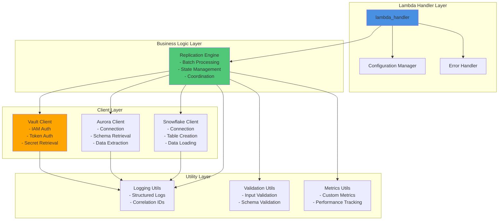

## Data Replication Sequence

### Complete Replication Sequence

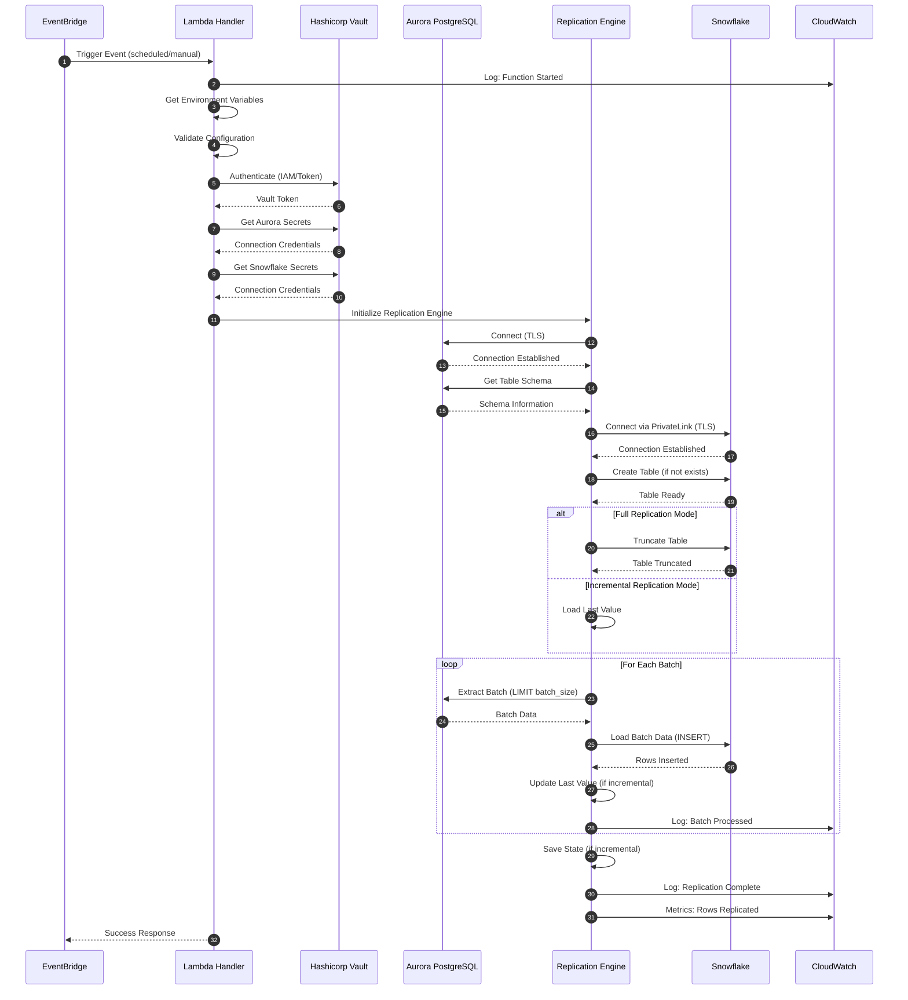

## Error Handling Architecture

### Error Handling Flow

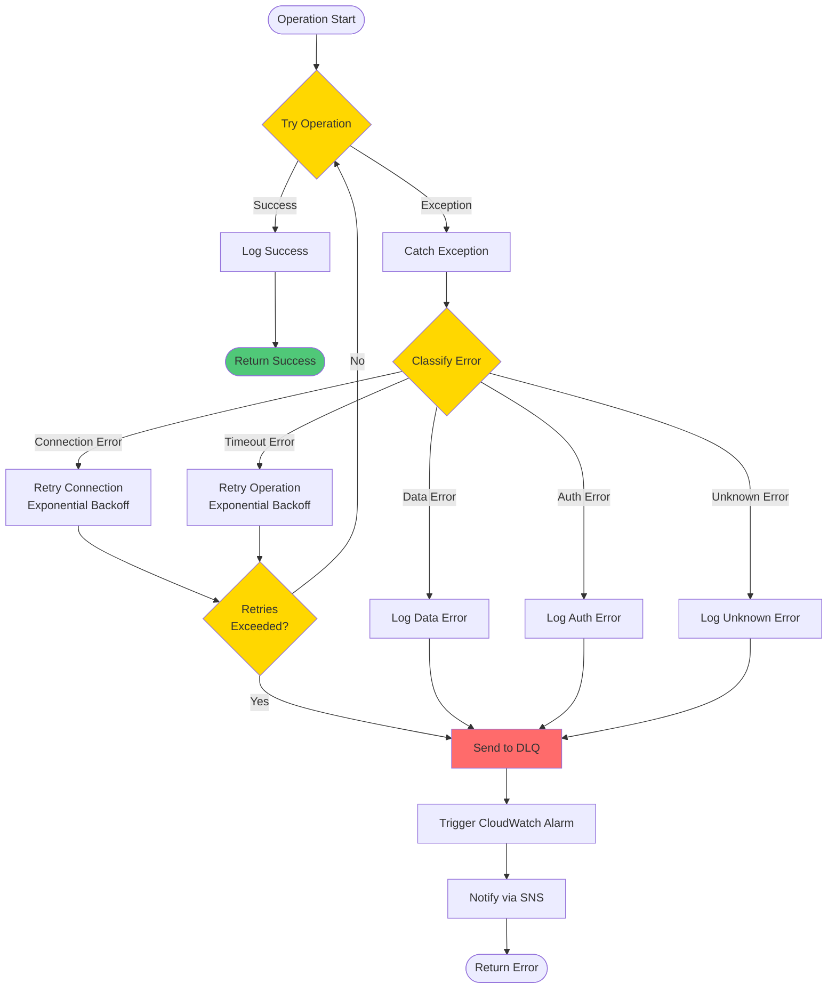

### Error Types and Handling

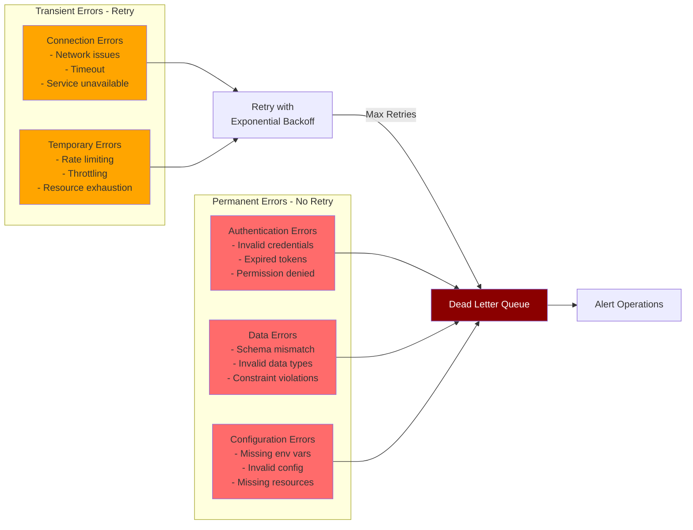

## Security Architecture Details

### Authentication and Authorization Flow

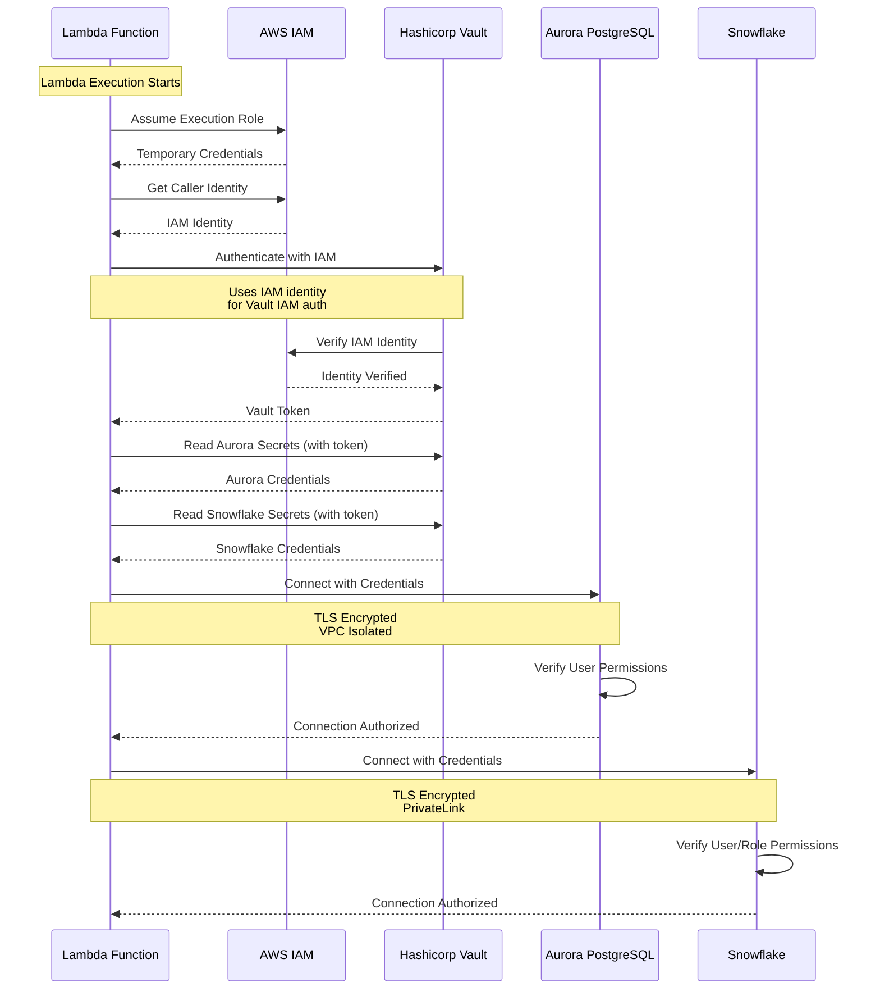

### Security Boundaries

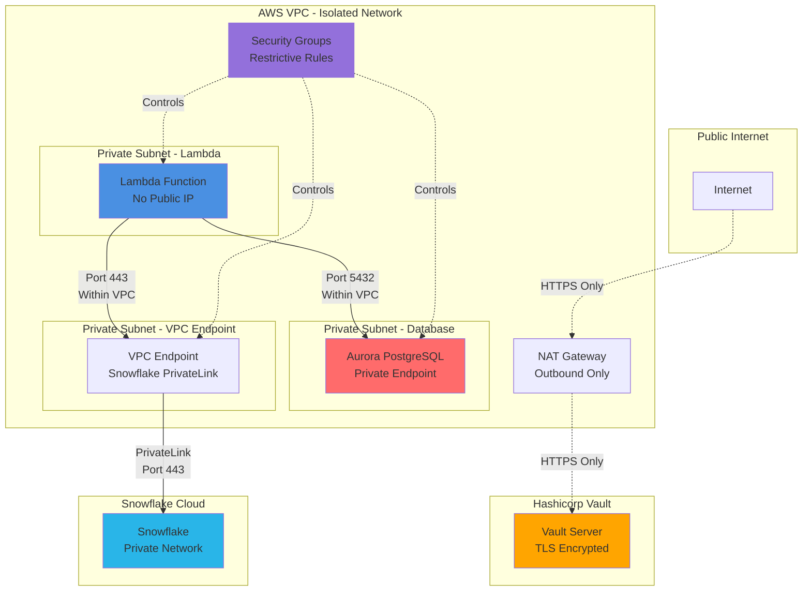

## Network Topology

### Detailed Network Architecture

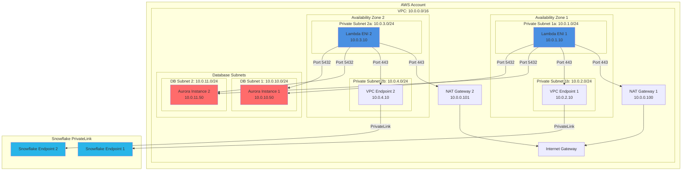

## Deployment Sequence

### Complete Deployment Flow

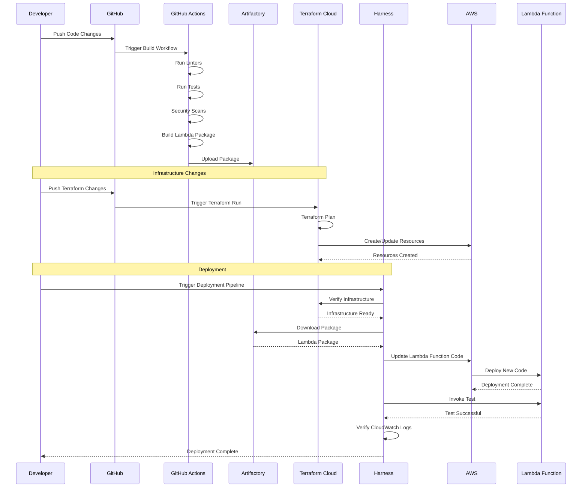

## Data Flow Details

### Incremental Replication State Flow

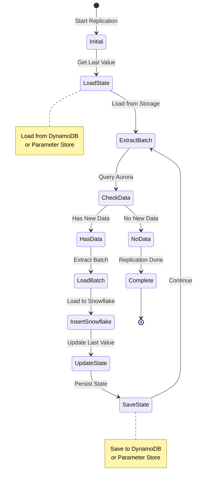

### Batch Processing State Machine

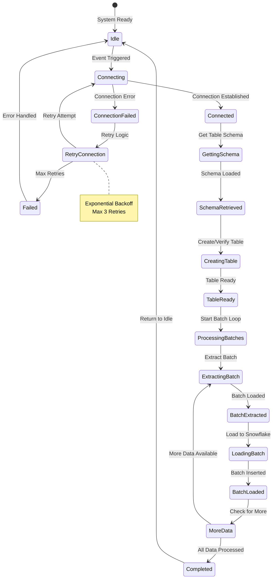

## Performance Architecture

### Performance Optimization Flow

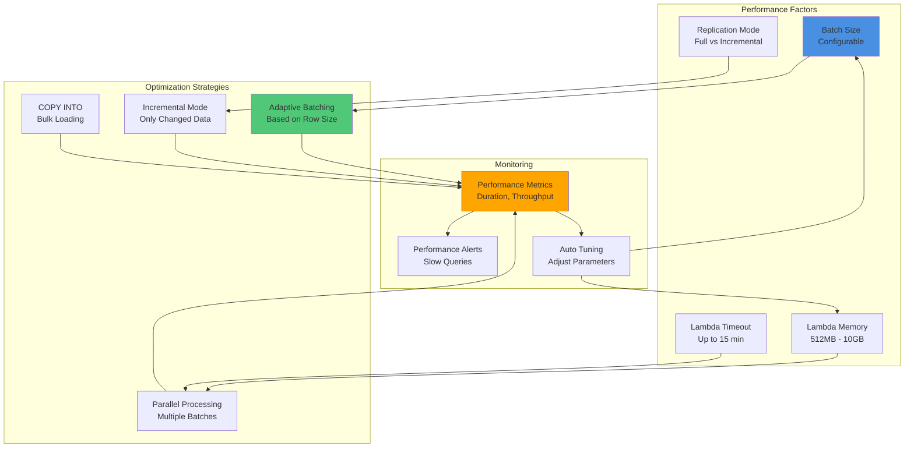

